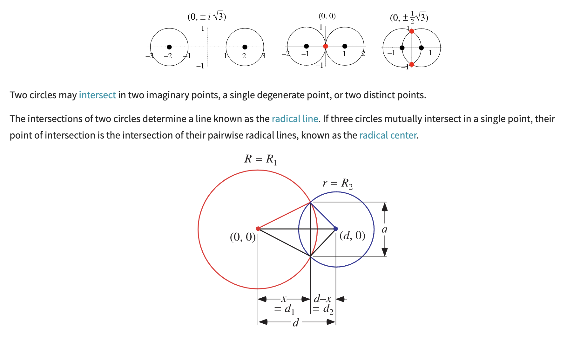

# Random Circles With No Overlap

## 스크린에 원을 무수히 많이 그린다고 할 때, 겹치지 않도록 하는 걸 어떻게 보장할 수 있는가?

### overlapping을 판단하는 기준 With Brute Force

(x,y) 좌표를 기준으로 이전 원과 겹치는지 판단한다. 어떻게 겹치는지 판단하는가? -> 원 사이 거리를 구한다.



두 원 사이의 거리가 두 원의 반지름 합보다 작으면 overlapping이라고 판단할 수 있다.<br>
(p5.js는 두 원 사이 거리를 구할 수 있는 dist 함수를 제공한다.)

이전 원의 정보를 기억해야 한다. -> 원의 기존 위치를 모두 저장해야 하므로 배열이 필요하다.

두 원이 overlapping이 아닐 때만 그리면 된다.<br>
여기서 for과 while의 차이를 분명히 알아야 한다.<br>
(25개를 그리고 싶다고 해서 단순히 for를 사용하면 안 된다. 25개를 강제하려면 while 문을 사용해야 한다. for과 while의 차이는 강제성에 있다.)

while의 특징은 강제성에 있는데, 이 강제성이 문제를 일으킬 수 있다. 랜덤한 원을 계속 생성하는데 계속해서 25개를 만들지 못할 수도 있다. 이때 프로그램이 멈출 수 있다.<br>
이런 경우를 대비해 protection과 같은 변수를 활용하는 것도 하나의 방법이다.

```js

var protection = 0;

// ...

protection++;
if(protection > 10000){
  break;
}
```

[Demo](https://editor.p5js.org/wooleejaan/full/73qnHAF7R)

### References

[9.8: Random Circles with No Overlap - p5.js Tutorial](https://www.youtube.com/watch?v=XATr_jdh-44&t=1s)<br>
[Circle-Circle Intersection](https://mathworld.wolfram.com/Circle-CircleIntersection.html)<br>
