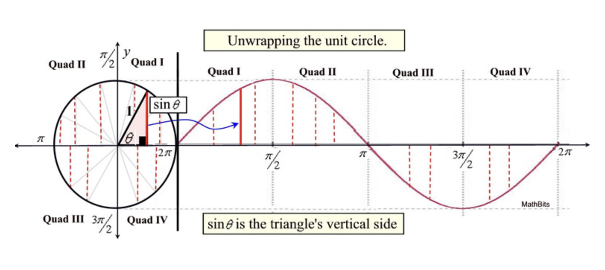

# Slider Dance

## 삼각함수로 만드는 물결 움직임

Sign 함수를 사용해 웨이브를 만들어 냅니다. 
offset을 추가해 각 slider의 움직임을 다르게 만듭니다. (offset 값만큼의 지연이 발생하고, 그에 따라 웨이브 애니메이션을 만들어 냅니다.)

[demo](https://editor.p5js.org/wooleejaan/full/6GeuyIA7e)

삼각함수는 원 안에 있는 직각 삼각형의 변 길이 비율을 다룬다. 
각도에 따라 변의 길이가 어떻게 달라지는지 알고 싶을 때 사용할 수 있다. 

삼각형은 `각도`가 커질수록 `높이 값`이 커진다. 
반대로 각도가 90도를 넘어서면, `각도`가 커질수록 점점 `높이 값`이 작아진다. 

다시 180도가 되면 높이가 0이 되고, 다시 반복한다. 커졌다가 작아졌다가를 반복한다.

(아래 sign function graph 참고)

Sign(x) 함수는 인자 x에 각도를 넣으면, 각도 x에 따른 높이 값을 반환한다. 
Cos(x) 함수는 인자 x에 각도를 넣으면, 각도 x에 따른 밑변의 길이 값을 반환한다.

### 참고자료

[8.16: The Slider Dance - p5.js Tutorial](https://www.youtube.com/watch?v=CMsD3IigG7g) 
[Unit Circle and Trig Graphs](https://mathbitsnotebook.com/Algebra2/TrigGraphs/TGUnitCircleGraphs.html) 
[What is the sine of an angle?](https://www.quora.com/What-is-the-sine-of-an-angle) 
[문과생도 이해하는 삼각함수의 원리](https://computer-choco.tistory.com/4) 
